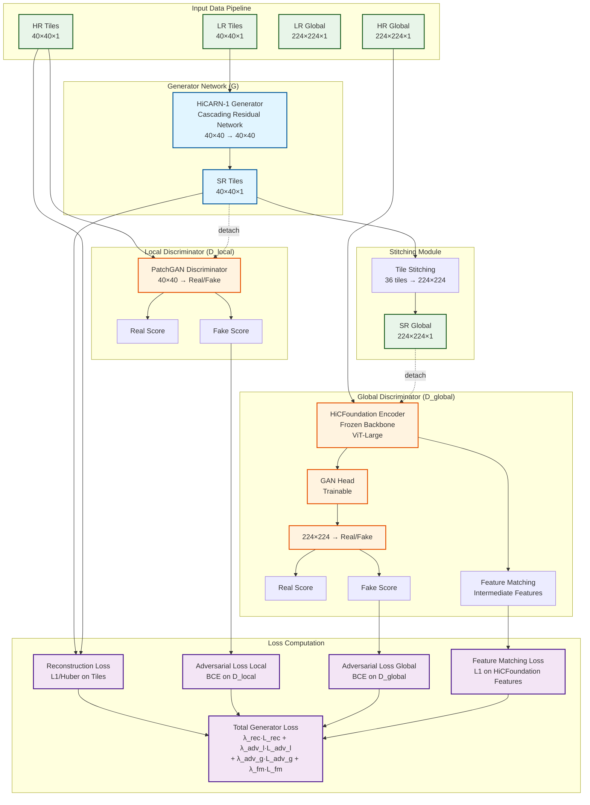

# Plug&Play GAN Architecture for Hi-C Resolution Enhancement

## Model Architecture Diagram



## Detailed Architecture Description

### 1. Generator (G): HiCARN-1
- **Architecture**: Cascading Residual Network
- **Input**: Low-resolution tiles (40×40×1)
- **Output**: Super-resolution tiles (40×40×1)
- **Components**:
  - Entry 3×3 convolution
  - 5 Cascading Blocks (each with 3 Residual Blocks)
  - Body 1×1 convolutions for feature fusion
  - Exit 3×3 convolution

### 2. Local Discriminator (D_local)
- **Type**: PatchGAN discriminator
- **Input**: 40×40×1 tiles
- **Output**: Real/Fake probability map
- **Architecture**: 
  - 4 convolutional blocks with BatchNorm and LeakyReLU
  - Final 3×3 convolution for binary classification

### 3. Global Discriminator (D_global)
- **Backbone**: HiCFoundation ViT-Large encoder (Frozen)
  - Vision Transformer with 24 layers
  - Embedding dimension: 1024
  - Patch size: 16×16
  - Input: 224×224×3 (RGB formatted)
- **Head**: Lightweight GAN head (Trainable)
  - Linear layers: 1024 → 256 → 1
  - Output: Real/Fake logits

### 4. Loss Functions

#### Generator Loss:
```
L_G = λ_rec · L_rec + λ_adv_local · L_adv_local + λ_adv_global · L_adv_global + λ_fm · L_fm
```

Where:
- **L_rec**: Huber loss between SR and HR tiles
- **L_adv_local**: BCE loss encouraging D_local(SR_tiles) → real
- **L_adv_global**: BCE loss encouraging D_global(SR_global) → real
- **L_fm**: L1 loss between HiCFoundation features of SR_global and HR_global

#### Discriminator Losses:
- **D_local**: BCE loss distinguishing real vs fake 40×40 tiles
- **D_global**: BCE loss distinguishing real vs fake 224×224 crops

### 5. Training Strategy

1. **Warmup Phase** (epochs 1-5):
   - Only reconstruction loss (λ_adv_local = λ_adv_global = 0)
   - Feature matching enabled

2. **Full Training**:
   - All losses active
   - Gradient clipping (max_norm = 0.5)
   - Adversarial loss clipping (max = 10.0)

### 6. Data Flow

```
LR Tiles (40×40) → Generator → SR Tiles (40×40)
                                    ↓
                              Stitch (6×6 grid)
                                    ↓
                            SR Global (224×224)
                                    ↓
                    ┌───────────────┴───────────────┐
                    ↓                               ↓
            D_local (40×40)              D_global (224×224)
                    ↓                               ↓
            Adversarial Loss              Adversarial Loss + Feature Matching
```

## Key Features

- **Multi-scale supervision**: Both local (40×40) and global (224×224) discriminators
- **Pre-trained foundation model**: Leverages HiCFoundation's learned representations
- **Feature matching**: Ensures global structure consistency using intermediate features
- **Stable training**: Gradient clipping, loss clipping, and warmup phase
