# Plug&Play GAN: Detailed Architecture Diagram

## Complete Data Flow Architecture

```mermaid
graph TB
    subgraph "Input Data"
        LR_TILES[LR Tiles<br/>B×N×1×40×40<br/>Low Resolution]
        HR_TILES[HR Tiles<br/>B×N×1×40×40<br/>Ground Truth]
        LR_GLOBAL[LR Global<br/>B×1×224×224]
        HR_GLOBAL[HR Global<br/>B×1×224×224]
    end
    
    subgraph "Generator: HiCARN-1"
        G_IN[Flatten<br/>B×N×1×40×40<br/>→ B*N×1×40×40]
        G_ENTRY[Entry Conv<br/>3×3 Conv<br/>1→64 channels]
        G_CB1[Cascading Block 1<br/>3×Residual Blocks<br/>+ Feature Fusion]
        G_CB2[Cascading Block 2<br/>3×Residual Blocks<br/>+ Feature Fusion]
        G_CB3[Cascading Block 3<br/>3×Residual Blocks<br/>+ Feature Fusion]
        G_CB4[Cascading Block 4<br/>3×Residual Blocks<br/>+ Feature Fusion]
        G_CB5[Cascading Block 5<br/>3×Residual Blocks<br/>+ Feature Fusion]
        G_EXIT[Exit Conv<br/>3×3 Conv<br/>64→1 channel]
        SR_TILES[SR Tiles<br/>B*N×1×40×40<br/>Super Resolution]
    end
    
    subgraph "Tile Stitching"
        RESHAPE[Reshape<br/>B*N×1×40×40<br/>→ B×N×1×40×40]
        GRID[6×6 Grid<br/>36 tiles]
        STITCH[Concatenate<br/>Rows & Columns]
        CROP[Crop/Pad<br/>→ 224×224]
        SR_GLOBAL[SR Global<br/>B×1×224×224]
    end
    
    subgraph "Local Discriminator: PatchGAN"
        DL_IN[Input<br/>B*N×1×40×40]
        DL_C1[Conv Block 1<br/>Conv2d 1→64<br/>Stride 2, BN, LeakyReLU]
        DL_C2[Conv Block 2<br/>Conv2d 64→128<br/>Stride 2, BN, LeakyReLU]
        DL_C3[Conv Block 3<br/>Conv2d 128→256<br/>Stride 2, BN, LeakyReLU]
        DL_C4[Conv Block 4<br/>Conv2d 256→512<br/>Stride 1, BN, LeakyReLU]
        DL_OUT[Output<br/>Conv2d 512→1<br/>3×3, Real/Fake Map]
        DL_SCORE[Local Score<br/>B*N×1×H×W]
    end
    
    subgraph "Global Discriminator: HiCFoundation"
        DG_IN[Input<br/>B×1×224×224]
        RGB_CONV[RGB Conversion<br/>Log Transform<br/>B×1×224×224<br/>→ B×3×224×224]
        NORM[ImageNet Normalization<br/>Mean/Std]
        DG_FORMAT[Formatted<br/>B×3×224×224]
        
        subgraph "HiCFoundation ViT Encoder (Frozen)"
            PATCH[Patch Embedding<br/>16×16 patches<br/>224×224 → 14×14 patches]
            POS[Positional Embedding<br/>+ CLS Token<br/>+ Count Token]
            VIT_B1[Transformer Block 1<br/>Multi-Head Attention<br/>MLP, LayerNorm]
            VIT_B2[Transformer Block 2]
            VIT_B3[Transformer Block 3]
            VIT_DOTS[...]
            VIT_B24[Transformer Block 24]
            VIT_NORM[LayerNorm]
            VIT_FEAT[Features<br/>B×197×1024<br/>CLS + 196 patches]
        end
        
        CLS_TOKEN[CLS Token<br/>B×1024]
        GAN_HEAD[GAN Head<br/>Linear 1024→256<br/>LeakyReLU<br/>Linear 256→1]
        DG_SCORE[Global Score<br/>B×1]
        FM_FEAT[Feature Matching<br/>Patch Features<br/>B×196×1024]
    end
    
    subgraph "Loss Computation"
        L1[L1/Huber Loss<br/>SR_tiles vs HR_tiles]
        BCE_LOCAL[BCE Loss<br/>D_local SR → Real]
        BCE_GLOBAL[BCE Loss<br/>D_global SR → Real]
        FM_LOSS[Feature Matching<br/>L1 Loss<br/>Features SR vs HR]
        L_TOTAL[Total Loss<br/>λ_rec·L1 + λ_adv_l·BCE_l<br/>+ λ_adv_g·BCE_g + λ_fm·FM]
    end
    
    %% Generator Flow
    LR_TILES --> G_IN
    G_IN --> G_ENTRY
    G_ENTRY --> G_CB1
    G_CB1 --> G_CB2
    G_CB2 --> G_CB3
    G_CB3 --> G_CB4
    G_CB4 --> G_CB5
    G_CB5 --> G_EXIT
    G_EXIT --> SR_TILES
    
    %% Stitching Flow
    SR_TILES --> RESHAPE
    RESHAPE --> GRID
    GRID --> STITCH
    STITCH --> CROP
    CROP --> SR_GLOBAL
    
    %% Local Discriminator Flow
    HR_TILES -.Real.-> DL_IN
    SR_TILES -.Fake.-> DL_IN
    DL_IN --> DL_C1
    DL_C1 --> DL_C2
    DL_C2 --> DL_C3
    DL_C3 --> DL_C4
    DL_C4 --> DL_OUT
    DL_OUT --> DL_SCORE
    DL_SCORE --> BCE_LOCAL
    
    %% Global Discriminator Flow
    HR_GLOBAL -.Real.-> DG_IN
    SR_GLOBAL -.Fake.-> DG_IN
    DG_IN --> RGB_CONV
    RGB_CONV --> NORM
    NORM --> DG_FORMAT
    DG_FORMAT --> PATCH
    PATCH --> POS
    POS --> VIT_B1
    VIT_B1 --> VIT_B2
    VIT_B2 --> VIT_B3
    VIT_B3 --> VIT_DOTS
    VIT_DOTS --> VIT_B24
    VIT_B24 --> VIT_NORM
    VIT_NORM --> VIT_FEAT
    VIT_FEAT --> CLS_TOKEN
    VIT_FEAT --> FM_FEAT
    CLS_TOKEN --> GAN_HEAD
    GAN_HEAD --> DG_SCORE
    DG_SCORE --> BCE_GLOBAL
    FM_FEAT --> FM_LOSS
    
    %% Loss Flow
    SR_TILES --> L1
    HR_TILES --> L1
    DL_SCORE --> BCE_LOCAL
    DG_SCORE --> BCE_GLOBAL
    FM_FEAT --> FM_LOSS
    
    L1 --> L_TOTAL
    BCE_LOCAL --> L_TOTAL
    BCE_GLOBAL --> L_TOTAL
    FM_LOSS --> L_TOTAL
    
    %% Styling
    classDef generator fill:#e3f2fd,stroke:#1976d2,stroke-width:3px
    classDef discriminator fill:#fff3e0,stroke:#f57c00,stroke-width:3px
    classDef vit fill:#f1f8e9,stroke:#558b2f,stroke-width:2px
    classDef loss fill:#fce4ec,stroke:#c2185b,stroke-width:2px
    classDef data fill:#e8eaf6,stroke:#3f51b5,stroke-width:2px
    classDef process fill:#fff9c4,stroke:#f9a825,stroke-width:2px
    
    class G_IN,G_ENTRY,G_CB1,G_CB2,G_CB3,G_CB4,G_CB5,G_EXIT,SR_TILES generator
    class DL_IN,DL_C1,DL_C2,DL_C3,DL_C4,DL_OUT,DL_SCORE,DG_IN,RGB_CONV,NORM,DG_FORMAT,GAN_HEAD,DG_SCORE discriminator
    class PATCH,POS,VIT_B1,VIT_B2,VIT_B3,VIT_DOTS,VIT_B24,VIT_NORM,VIT_FEAT,CLS_TOKEN,FM_FEAT vit
    class L1,BCE_LOCAL,BCE_GLOBAL,FM_LOSS,L_TOTAL loss
    class LR_TILES,HR_TILES,LR_GLOBAL,HR_GLOBAL,SR_GLOBAL data
    class RESHAPE,GRID,STITCH,CROP process
```



## Layer-by-Layer Architecture Details

### Generator (HiCARN-1) - Detailed Structure

```
Input: B×N×1×40×40 (LR tiles)
  ↓
Flatten: B*N×1×40×40
  ↓
Entry Conv: 3×3, 1→64 channels, padding=1
  ↓
Cascading Block 1:
  ├─ Residual Block 1 (3×3 Conv, ReLU)
  ├─ Residual Block 2 (3×3 Conv, ReLU)
  ├─ Residual Block 3 (3×3 Conv, ReLU)
  └─ Feature Fusion: Concat + 1×1 Conv (64×2→64)
  ↓
Cascading Block 2: (same structure)
  └─ Feature Fusion: Concat + 1×1 Conv (64×3→64)
  ↓
Cascading Block 3: (same structure)
  └─ Feature Fusion: Concat + 1×1 Conv (64×4→64)
  ↓
Cascading Block 4: (same structure)
  └─ Feature Fusion: Concat + 1×1 Conv (64×5→64)
  ↓
Cascading Block 5: (same structure)
  └─ Feature Fusion: Concat + 1×1 Conv (64×6→64)
  ↓
Exit Conv: 3×3, 64→1 channel, padding=1
  ↓
Output: B*N×1×40×40 (SR tiles)
```

### Local Discriminator (PatchGAN) - Detailed Structure

```
Input: B*N×1×40×40
  ↓
Conv Block 1:
  Conv2d(1, 64, kernel_size=3, stride=2, padding=1)
  BatchNorm2d(64)
  LeakyReLU(0.2)
  Output: B*N×64×20×20
  ↓
Conv Block 2:
  Conv2d(64, 128, kernel_size=3, stride=2, padding=1)
  BatchNorm2d(128)
  LeakyReLU(0.2)
  Output: B*N×128×10×10
  ↓
Conv Block 3:
  Conv2d(128, 256, kernel_size=3, stride=2, padding=1)
  BatchNorm2d(256)
  LeakyReLU(0.2)
  Output: B*N×256×5×5
  ↓
Conv Block 4:
  Conv2d(256, 512, kernel_size=3, stride=1, padding=1)
  BatchNorm2d(512)
  LeakyReLU(0.2)
  Output: B*N×512×5×5
  ↓
Output Conv:
  Conv2d(512, 1, kernel_size=3, padding=1)
  Output: B*N×1×5×5 (Real/Fake probability map)
```

### Global Discriminator (HiCFoundation) - Detailed Structure

```
Input: B×1×224×224 (Single channel Hi-C)
  ↓
RGB Conversion:
  Log10 transform
  Create 3 channels: [ones, inverted, inverted]
  Output: B×3×224×224
  ↓
ImageNet Normalization:
  Mean: [0.485, 0.456, 0.406]
  Std: [0.229, 0.224, 0.225]
  Output: B×3×224×224
  ↓
Patch Embedding:
  16×16 patches → 14×14 = 196 patches
  Embedding dim: 1024
  Output: B×196×1024
  ↓
Add Tokens:
  CLS token: B×1×1024 (learnable)
  Count token: B×1×1024 (from total_count)
  Positional embedding: B×197×1024 (sinusoidal)
  Output: B×197×1024
  ↓
Vision Transformer Encoder (24 layers, FROZEN):
  For each Transformer Block:
    ├─ Multi-Head Self-Attention (16 heads)
    ├─ LayerNorm
    ├─ MLP (expand 4×, then project back)
    └─ LayerNorm
  Output: B×197×1024
  ↓
Extract Features:
  CLS token: B×1024 → GAN Head
  Patch tokens: B×196×1024 → Feature Matching
  ↓
GAN Head (Trainable):
  Linear(1024, 256)
  LeakyReLU(0.2)
  Linear(256, 1)
  Output: B×1 (Real/Fake logits)
```

## Complete Forward Pass Flow

### Training Step:

1. **Input Preparation**
   - Load batch: LR tiles (40×40), HR tiles (40×40), LR global (224×224), HR global (224×224)

2. **Generator Forward**
   - LR tiles → HiCARN-1 Generator → SR tiles (40×40)
   - Stitch SR tiles → SR global (224×224)

3. **Discriminator Forward (for D update)**
   - **D_local**: HR tiles (real) + SR tiles.detach() (fake) → Real/Fake scores
   - **D_global**: HR global (real) + SR global.detach() (fake) → Real/Fake scores

4. **Discriminator Loss & Update**
   - D_local loss = BCE(real_score, 1) + BCE(fake_score, 0)
   - D_global loss = BCE(real_score, 1) + BCE(fake_score, 0)
   - Update D_local and D_global

5. **Generator Forward (for G update)**
   - **D_local**: SR tiles → Fake score
   - **D_global**: SR global → Fake score + Intermediate features

6. **Generator Loss & Update**
   - Reconstruction: Huber(SR_tiles, HR_tiles)
   - Adversarial Local: BCE(D_local(SR_tiles), 1)
   - Adversarial Global: BCE(D_global(SR_global), 1)
   - Feature Matching: L1(Features_SR, Features_HR)
   - Total: Weighted sum of all losses
   - Update Generator

## Key Architectural Features

1. **Multi-Scale Processing**
   - Local: 40×40 tiles for fine-grained detail
   - Global: 224×224 crops for structural consistency

2. **Pre-trained Foundation Model**
   - HiCFoundation ViT-Large encoder (frozen)
   - Leverages learned Hi-C representations
   - Only GAN head is trainable

3. **Cascading Architecture**
   - Generator uses cascading residual blocks
   - Progressive feature refinement
   - Multi-level feature fusion

4. **Dual Discriminator Strategy**
   - PatchGAN for local texture realism
   - Foundation model for global structure realism
