# Plug&Play GAN: Visual Architecture Diagram

## Complete Data Flow with Layer Details

```mermaid
flowchart TD
    subgraph INPUT[" "]
        LR40["LR Tiles<br/>B×N×1×40×40"]
        HR40["HR Tiles<br/>B×N×1×40×40"]
        LR224["LR Global<br/>B×1×224×224"]
        HR224["HR Global<br/>B×1×224×224"]
    end
    
    subgraph GEN["GENERATOR: HiCARN-1"]
        direction TB
        G1["Flatten<br/>B×N×1×40×40<br/>↓<br/>B*N×1×40×40"]
        G2["Entry Conv<br/>3×3 Conv<br/>1 → 64 channels<br/>B*N×64×40×40"]
        G3["Cascading Block 1<br/>┌─────────────────┐<br/>│ Residual Block 1│<br/>│ Residual Block 2│<br/>│ Residual Block 3│<br/>│ Feature Fusion  │<br/>└─────────────────┘<br/>B*N×64×40×40"]
        G4["Cascading Block 2<br/>Same Structure<br/>B*N×64×40×40"]
        G5["Cascading Block 3<br/>Same Structure<br/>B*N×64×40×40"]
        G6["Cascading Block 4<br/>Same Structure<br/>B*N×64×40×40"]
        G7["Cascading Block 5<br/>Same Structure<br/>B*N×64×40×40"]
        G8["Exit Conv<br/>3×3 Conv<br/>64 → 1 channel<br/>B*N×1×40×40"]
        SR40["SR Tiles<br/>B*N×1×40×40"]
    end
    
    subgraph STITCH["TILE STITCHING"]
        direction TB
        S1["Reshape<br/>B*N×1×40×40<br/>↓<br/>B×N×1×40×40"]
        S2["Arrange 6×6 Grid<br/>36 tiles per sample"]
        S3["Concatenate Horizontally<br/>6 tiles × 40 = 240 width"]
        S4["Concatenate Vertically<br/>6 rows × 40 = 240 height"]
        S5["Crop to 224×224<br/>B×224×224"]
        SR224["SR Global<br/>B×1×224×224"]
    end
    
    subgraph DLOCAL["LOCAL DISCRIMINATOR: PatchGAN"]
        direction TB
        D1["Input<br/>B*N×1×40×40"]
        D2["Conv Block 1<br/>Conv: 1→64<br/>Stride: 2<br/>BN + LeakyReLU<br/>B*N×64×20×20"]
        D3["Conv Block 2<br/>Conv: 64→128<br/>Stride: 2<br/>BN + LeakyReLU<br/>B*N×128×10×10"]
        D4["Conv Block 3<br/>Conv: 128→256<br/>Stride: 2<br/>BN + LeakyReLU<br/>B*N×256×5×5"]
        D5["Conv Block 4<br/>Conv: 256→512<br/>Stride: 1<br/>BN + LeakyReLU<br/>B*N×512×5×5"]
        D6["Output Conv<br/>Conv: 512→1<br/>3×3 kernel<br/>B*N×1×5×5"]
        DL_SCORE["Local Score<br/>Real/Fake Map"]
    end
    
    subgraph DGLOBAL["GLOBAL DISCRIMINATOR: HiCFoundation"]
        direction TB
        DG1["Input<br/>B×1×224×224"]
        DG2["RGB Conversion<br/>Log10 Transform<br/>Create 3 Channels<br/>B×3×224×224"]
        DG3["ImageNet Normalization<br/>Mean/Std<br/>B×3×224×224"]
        
        subgraph VIT["ViT Encoder (Frozen)"]
            direction TB
            V1["Patch Embedding<br/>16×16 patches<br/>224×224 → 14×14<br/>196 patches<br/>B×196×1024"]
            V2["Add Tokens<br/>+ CLS Token<br/>+ Count Token<br/>+ Positional Embed<br/>B×197×1024"]
            V3["Transformer Block 1<br/>Multi-Head Attn (16 heads)<br/>MLP (expand 4×)<br/>LayerNorm<br/>B×197×1024"]
            V4["Transformer Block 2<br/>..."]
            V5["..."]
            V6["Transformer Block 24<br/>B×197×1024"]
            V7["LayerNorm<br/>B×197×1024"]
        end
        
        V8["Extract Features<br/>CLS: B×1024<br/>Patches: B×196×1024"]
        DG4["GAN Head (Trainable)<br/>Linear: 1024→256<br/>LeakyReLU<br/>Linear: 256→1<br/>B×1"]
        DG_SCORE["Global Score<br/>Real/Fake"]
        FM_FEAT["Feature Matching<br/>B×196×1024"]
    end
    
    subgraph LOSS["LOSS COMPUTATION"]
        L1["Reconstruction Loss<br/>Huber Loss<br/>SR_tiles vs HR_tiles"]
        L2["Adversarial Local<br/>BCE Loss<br/>D_local(SR) → Real"]
        L3["Adversarial Global<br/>BCE Loss<br/>D_global(SR) → Real"]
        L4["Feature Matching<br/>L1 Loss<br/>Features_SR vs Features_HR"]
        LT["Total Loss<br/>λ_rec·L1 + λ_adv_l·L2<br/>+ λ_adv_g·L3 + λ_fm·L4"]
    end
    
    %% Generator Flow
    LR40 --> G1
    G1 --> G2
    G2 --> G3
    G3 --> G4
    G4 --> G5
    G5 --> G6
    G6 --> G7
    G7 --> G8
    G8 --> SR40
    
    %% Stitching Flow
    SR40 --> S1
    S1 --> S2
    S2 --> S3
    S3 --> S4
    S4 --> S5
    S5 --> SR224
    
    %% Local Discriminator Flow
    HR40 -.Real.-> D1
    SR40 -.Fake.-> D1
    D1 --> D2
    D2 --> D3
    D3 --> D4
    D4 --> D5
    D5 --> D6
    D6 --> DL_SCORE
    
    %% Global Discriminator Flow
    HR224 -.Real.-> DG1
    SR224 -.Fake.-> DG1
    DG1 --> DG2
    DG2 --> DG3
    DG3 --> V1
    V1 --> V2
    V2 --> V3
    V3 --> V4
    V4 --> V5
    V5 --> V6
    V6 --> V7
    V7 --> V8
    V8 --> DG4
    V8 --> FM_FEAT
    DG4 --> DG_SCORE
    
    %% Loss Flow
    SR40 --> L1
    HR40 --> L1
    DL_SCORE --> L2
    DG_SCORE --> L3
    FM_FEAT --> L4
    
    L1 --> LT
    L2 --> LT
    L3 --> LT
    L4 --> LT
    
    %% Styling
    classDef gen fill:#e3f2fd,stroke:#1565c0,stroke-width:3px
    classDef disc fill:#fff3e0,stroke:#e65100,stroke-width:3px
    classDef vit fill:#e8f5e9,stroke:#2e7d32,stroke-width:2px
    classDef loss fill:#fce4ec,stroke:#c2185b,stroke-width:3px
    classDef data fill:#f3e5f5,stroke:#6a1b9a,stroke-width:2px
    classDef process fill:#fff9c4,stroke:#f57f17,stroke-width:2px
    
    class G1,G2,G3,G4,G5,G6,G7,G8,SR40 gen
    class D1,D2,D3,D4,D5,D6,DL_SCORE,DG1,DG2,DG3,DG4,DG_SCORE disc
    class V1,V2,V3,V4,V5,V6,V7,V8,FM_FEAT vit
    class L1,L2,L3,L4,LT loss
    class LR40,HR40,LR224,HR224,SR224 data
    class S1,S2,S3,S4,S5 process
```



## Detailed Component Breakdown

### Generator: HiCARN-1 Architecture

```
┌─────────────────────────────────────────────────────────────┐
│                    GENERATOR (HiCARN-1)                      │
├─────────────────────────────────────────────────────────────┤
│                                                               │
│  Input: B*N×1×40×40                                          │
│    │                                                          │
│    ▼                                                          │
│  Entry Conv: 3×3, 1→64                                       │
│    │                                                          │
│    ▼                                                          │
│  ┌──────────────────────────────────────────────┐            │
│  │ Cascading Block 1                            │            │
│  │  ┌──────────────┐                            │            │
│  │  │ Residual 1   │ → 3×3 Conv → ReLU          │            │
│  │  └──────────────┘                            │            │
│  │  ┌──────────────┐                            │            │
│  │  │ Residual 2   │ → 3×3 Conv → ReLU          │            │
│  │  └──────────────┘                            │            │
│  │  ┌──────────────┐                            │            │
│  │  │ Residual 3   │ → 3×3 Conv → ReLU          │            │
│  │  └──────────────┘                            │            │
│  │  Concat [input, r1, r2, r3]                 │            │
│  │  1×1 Conv: 64×4 → 64                         │            │
│  └──────────────────────────────────────────────┘            │
│    │                                                          │
│    ▼                                                          │
│  Cascading Block 2 (same structure)                           │
│    │                                                          │
│    ▼                                                          │
│  Cascading Block 3 (same structure)                           │
│    │                                                          │
│    ▼                                                          │
│  Cascading Block 4 (same structure)                           │
│    │                                                          │
│    ▼                                                          │
│  Cascading Block 5 (same structure)                           │
│    │                                                          │
│    ▼                                                          │
│  Exit Conv: 3×3, 64→1                                        │
│    │                                                          │
│    ▼                                                          │
│  Output: B*N×1×40×40                                         │
│                                                               │
└─────────────────────────────────────────────────────────────┘
```

### Global Discriminator: HiCFoundation ViT Structure

```
┌─────────────────────────────────────────────────────────────┐
│          GLOBAL DISCRIMINATOR (HiCFoundation)                 │
├─────────────────────────────────────────────────────────────┤
│                                                               │
│  Input: B×1×224×224 (Single Channel Hi-C)                    │
│    │                                                          │
│    ▼                                                          │
│  RGB Conversion:                                              │
│    • Log10 Transform                                          │
│    • Create 3 channels: [ones, inverted, inverted]           │
│    Output: B×3×224×224                                        │
│    │                                                          │
│    ▼                                                          │
│  ImageNet Normalization                                       │
│    Output: B×3×224×224                                        │
│    │                                                          │
│    ▼                                                          │
│  ┌──────────────────────────────────────────────┐            │
│  │ Vision Transformer Encoder (FROZEN)           │            │
│  │                                                │            │
│  │  Patch Embedding:                              │            │
│  │    16×16 patches → 14×14 = 196 patches        │            │
│  │    Embedding dim: 1024                         │            │
│  │    Output: B×196×1024                          │            │
│  │    │                                            │            │
│  │    ▼                                            │            │
│  │  Add Tokens:                                    │            │
│  │    + CLS Token (learnable): B×1×1024            │            │
│  │    + Count Token: B×1×1024                      │            │
│  │    + Positional Embed: B×197×1024               │            │
│  │    Output: B×197×1024                           │            │
│  │    │                                            │            │
│  │    ▼                                            │            │
│  │  Transformer Blocks (×24):                    │            │
│  │    ┌────────────────────────────┐              │            │
│  │    │ Multi-Head Self-Attention │              │            │
│  │    │  16 heads, 1024 dim        │              │            │
│  │    └────────────────────────────┘              │            │
│  │    │                                            │            │
│  │    ▼                                            │            │
│  │    LayerNorm                                    │            │
│  │    │                                            │            │
│  │    ▼                                            │            │
│  │    MLP:                                         │            │
│  │     1024 → 4096 → 1024                          │            │
│  │    │                                            │            │
│  │    ▼                                            │            │
│  │    LayerNorm                                    │            │
│  │    Output: B×197×1024                           │            │
│  │    │                                            │            │
│  │    ▼ (repeat 24 times)                          │            │
│  │                                                │            │
│  │  Final LayerNorm                                │            │
│  │    Output: B×197×1024                           │            │
│  └──────────────────────────────────────────────┘            │
│    │                                                          │
│    ├──────────────────┬──────────────────┐                   │
│    ▼                    ▼                  ▼                   │
│  CLS Token          Patch Tokens      Patch Tokens            │
│  B×1024             B×196×1024        B×196×1024             │
│    │                    │                  │                   │
│    ▼                    │                  │                   │
│  ┌──────────────────────┘                  │                   │
│  │ GAN Head (Trainable)                     │                   │
│  │  Linear: 1024 → 256                      │                   │
│  │  LeakyReLU(0.2)                          │                   │
│  │  Linear: 256 → 1                         │                   │
│  │  Output: B×1 (Real/Fake logits)          │                   │
│  └──────────────────────────────────────────┘                   │
│                                                               │
│  Feature Matching:                                           │
│    Patch Features (SR) vs Patch Features (HR)                │
│    L1 Loss on B×196×1024 features                            │
│                                                               │
└─────────────────────────────────────────────────────────────┘
```

## Complete Forward Pass Sequence

### Step 1: Generator Forward Pass
```
LR Tiles (B×N×1×40×40)
    ↓
Flatten to (B*N×1×40×40)
    ↓
HiCARN-1 Generator
    ├─ Entry Conv (1→64 channels)
    ├─ 5× Cascading Blocks
    │   └─ Each: 3× Residual Blocks + Feature Fusion
    └─ Exit Conv (64→1 channel)
    ↓
SR Tiles (B*N×1×40×40)
```

### Step 2: Tile Stitching
```
SR Tiles (B*N×1×40×40)
    ↓
Reshape to (B×N×1×40×40)
    ↓
Arrange in 6×6 grid (36 tiles)
    ↓
Concatenate horizontally: 6 tiles × 40 = 240 width
    ↓
Concatenate vertically: 6 rows × 40 = 240 height
    ↓
Crop to 224×224
    ↓
SR Global (B×1×224×224)
```

### Step 3: Discriminator Forward Passes

#### D_local:
```
HR Tiles (real) / SR Tiles.detach() (fake)
    ↓
PatchGAN Discriminator
    ├─ Conv Block 1: 1→64, stride=2 → 20×20
    ├─ Conv Block 2: 64→128, stride=2 → 10×10
    ├─ Conv Block 3: 128→256, stride=2 → 5×5
    ├─ Conv Block 4: 256→512, stride=1 → 5×5
    └─ Output Conv: 512→1 → 5×5
    ↓
Real/Fake Score Map (B*N×1×5×5)
```

#### D_global:
```
HR Global (real) / SR Global.detach() (fake)
    ↓
RGB Conversion + Normalization
    ↓
HiCFoundation ViT Encoder (Frozen)
    ├─ Patch Embedding: 224×224 → 196 patches
    ├─ Add Tokens: CLS + Count + Position
    ├─ 24× Transformer Blocks
    └─ LayerNorm
    ↓
Extract Features:
    ├─ CLS Token → GAN Head → Real/Fake Score
    └─ Patch Features → Feature Matching
```

### Step 4: Loss Computation
```
Generator Loss:
    L_G = λ_rec · Huber(SR_tiles, HR_tiles)
        + λ_adv_local · BCE(D_local(SR_tiles), 1)
        + λ_adv_global · BCE(D_global(SR_global), 1)
        + λ_fm · L1(Features_SR, Features_HR)

Discriminator Losses:
    L_D_local = BCE(D_local(HR_tiles), 1) + BCE(D_local(SR_tiles), 0)
    L_D_global = BCE(D_global(HR_global), 1) + BCE(D_global(SR_global), 0)
```

## Data Dimensions Throughout Pipeline

| Stage | Shape | Description |
|-------|-------|-------------|
| Input LR Tiles | B×N×1×40×40 | Batch × N tiles × channels × height × width |
| Generator Input | B*N×1×40×40 | Flattened for batch processing |
| Generator Output | B*N×1×40×40 | Super-resolved tiles |
| Stitched Global | B×1×224×224 | 6×6 grid of tiles stitched together |
| D_local Input | B*N×1×40×40 | Individual tiles |
| D_local Output | B*N×1×5×5 | Real/Fake probability map |
| D_global Input | B×1×224×224 | Global crop |
| D_global RGB | B×3×224×224 | Converted to RGB format |
| ViT Patches | B×196×1024 | 14×14 patches, 1024 dim |
| ViT Output | B×197×1024 | CLS + 196 patches |
| GAN Head Output | B×1 | Real/Fake logits |
